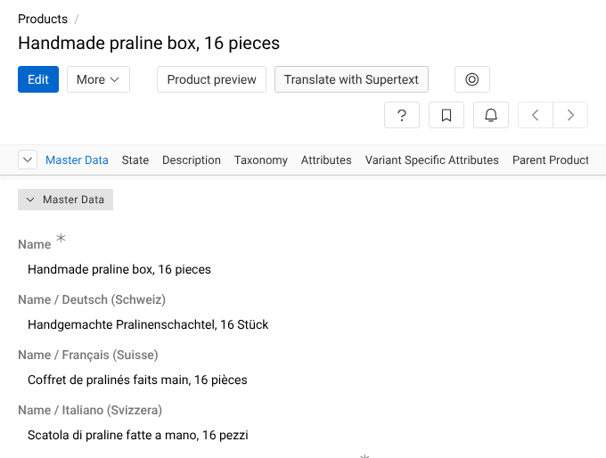

# Supertext Translation for AtroPIM

Translate AtroPIM products, and any other AtroCore record, into your other languages with **Supertext AI**: a **Translate with Supertext** button on the product and a mass action in the product list.

The record's multilingual texts go to Supertext in one request per language and come back into that language's fields, saved through AtroCore's own permissions, validation and history. Editors review and adjust the translation in AtroPIM as usual.

- Translates multilingual text, Markdown and rich text fields and attribute values (bold text, links and lists are kept; whole sentences are translated)
- Products, categories, brands or any other entity: an AtroCore **action** of the new type *Translate with Supertext* per entity, as a button, in the *More* menu and as a mass action, optionally in the background
- Fields that already have text in a language are kept unless the action overwrites them
- The API key lives in an AtroCore **connection** of type *Supertext* (encrypted, *Test connection*), or in `SUPERTEXT_API_KEY`
- Source and target languages, form of address and Supertext language codes are configurable
- Console commands `supertext translate` and `supertext check`; English and German interface



## Documentation

| Guide | For |
| --- | --- |
| [Installation guide](docs/INSTALLATION.md) | Administrators: requirements, install, API key, the action, languages, permissions, settings, troubleshooting |
| [User guide](docs/USER_GUIDE.md) | Editors: translating one or several products, reviewing, translating again, what gets translated |
| [Developer guide](docs/DEVELOPER.md) | Architecture, API protocol, local development, tests, demo deployment, releases |

Quick start for AtroCore 2.4 / AtroPIM 1.16 (you need a [Supertext account](https://www.supertext.com/person/en/account/signin) and an API key from [supertext.com → Integrations → API](https://www.supertext.com/en/integrations/api), which requires the Admin role): add `{"type": "vcs", "url": "https://github.com/Supertext/AtroPIM-Supertext-Translation"}` to the `repositories` in your AtroCore project's `composer.json`, then

```bash
php atrocore-installer.phar require supertext/atropim-supertext-translation:dev-main
```

Create a connection of type **Supertext** with the key under **Administration → Connections**, and an action of type **Translate with Supertext** for *Product* under **Administration → Actions**.

## Demo

`demo/` is an AtroPIM with English sample products, a multilingual attribute and German, French and Italian (Switzerland) as additional languages, deployed to Railway from this repository: <https://atropim-production.up.railway.app/>. See the [developer guide](docs/DEVELOPER.md#demo-railway).

## Changelog and roadmap

See [CHANGELOG.md](CHANGELOG.md) and [Known limitations / roadmap](docs/DEVELOPER.md#known-limitations--roadmap).

<!-- supertext-plugins:start (shared list, keep identical in every Supertext plugin repo) -->
## Supertext plugins for other systems

Supertext offers AI and professional translation plugins for these systems:

### Content management systems (CMS)

| System | Plugin | Type of integration | What it does |
| --- | --- | --- | --- |
| Adobe Experience Manager | [supertext-aem-connector](https://github.com/Supertext/supertext-aem-connector) | Translation connector: two AEM content packages for AEM's Translation Integration Framework. | Sends AEM translation projects to Supertext and imports the results |
| Contao | [Contao-Supertext-Translation](https://github.com/Supertext/Contao-Supertext-Translation) | Contao bundle (Composer) that adds a back-end action. | *Translate with Supertext* in the site structure: pages or whole websites into other languages |
| Craft CMS | [CraftCms-Supertext-Translation](https://github.com/Supertext/CraftCms-Supertext-Translation) | Craft plugin (Composer) with a panel on the entry page. | Translates entries into your other sites, Matrix and rich text included |
| Directus | [Directus-Supertext-Translation](https://github.com/Supertext/Directus-Supertext-Translation) | Directus extension bundle (npm): interface, endpoint, Flow operation and module. | *Translate with Supertext* box on the item form, fills the Translations field |
| django CMS | [djangoCMS-Supertext-Translation](https://github.com/Supertext/djangoCMS-Supertext-Translation) | Django app (Python package) that adds a toolbar entry. | Translates pages and their plugins from the toolbar |
| Drupal | [tmgmt_supertext_ai](https://www.drupal.org/project/tmgmt_supertext_ai) | Drupal module: a translator provider for the Translation Management Tool (TMGMT), by MD Systems. | Translates TMGMT jobs with Supertext AI |
| Ghost | [Ghost-Supertext-Translation](https://github.com/Supertext/Ghost-Supertext-Translation) | Separate connector service (Ghost has no admin plugins): works through internal tags, webhooks and the Admin API. | Tag a post `#translate-…` and a translated draft appears |
| Grav | [Grav-Supertext-Translation](https://github.com/Supertext/Grav-Supertext-Translation) | Grav 2 plugin with an Admin2 panel. | Supertext panel in the page editor, Markdown kept intact |
| Joomla | [Joomla-Supertext-Translation](https://github.com/Supertext/Joomla-Supertext-Translation) | Joomla system plugin (installable package). | Translates articles into linked, unpublished language versions |
| Magnolia | [Magnolia-Supertext-Translation](https://github.com/Supertext/Magnolia-Supertext-Translation) | Magnolia module (Maven jar) that adds an action to the Pages app and a settings app. | *Translate with Supertext* in the page list and page editor: pages and their components into the site's languages |
| Neos | [Neos-Supertext-Translation](https://github.com/Supertext/Neos-Supertext-Translation) | Neos package (Composer) that hooks into the content repository; no new UI. | Translates automatically when an editor creates a page in another language |
| Orchard Core | [OrchardCore-Supertext-Translation](https://github.com/Supertext/OrchardCore-Supertext-Translation) | Orchard Core module (.NET) with an admin page and a localization hook. | Translates content items into other cultures, on demand or on localization |
| Payload CMS | [Payload-Supertext-Translation](https://github.com/Supertext/Payload-Supertext-Translation) | Payload plugin (npm) added to `payload.config`. | *Translate* button for localized collections and globals |
| Silverstripe | [Silverstripe-Supertext-Translation](https://github.com/Supertext/Silverstripe-Supertext-Translation) | Silverstripe module (Composer) on top of Fluent. | Supertext tab translates pages and Elemental blocks into Fluent locales |
| Strapi | [Strapi-Supertext-Translation](https://github.com/Supertext/Strapi-Supertext-Translation) | Strapi 5 plugin (npm) with a Content Manager panel. | Translates entries into other locales from the Content Manager |
| TYPO3 | [Typo3-Supertext-Translation](https://github.com/Supertext/Typo3-Supertext-Translation) | TYPO3 extension (Composer) that hooks into TYPO3's own localization; no new UI. | Translates pages and content elements as editors localize them |
| Umbraco | [Umbraco-Supertext-Translation](https://github.com/Supertext/Umbraco-Supertext-Translation) | Umbraco package (NuGet) with a backoffice extension. | *Translate with Supertext* for pages, block lists and grids included |
| Wagtail | [Wagtail-Supertext-Translation](https://github.com/Supertext/Wagtail-Supertext-Translation) | Python package: a machine translator for wagtail-localize. | Translates pages and snippets inside wagtail-localize's editor |
| WordPress (Polylang) | [supertext-wordpress-polylang](https://github.com/Supertext/supertext-wordpress-polylang) | WordPress plugin: a machine-translation service for Polylang Pro, plus professional translation orders. | AI translation next to DeepL in Polylang, and human translation orders |

### Product information management (PIM)

| System | Plugin | Type of integration | What it does |
| --- | --- | --- | --- |
| Akeneo PIM | [Akeneo-Supertext-Translation](https://github.com/Supertext/Akeneo-Supertext-Translation-) | Symfony bundle (Composer) for the Community Edition, with an action on the product edit form and a System page. | *Translate with Supertext* for products and product models, into your other locales |
| AtroPIM | [AtroPIM-Supertext-Translation](https://github.com/Supertext/AtroPIM-Supertext-Translation) | AtroCore module (Composer) that adds an action type and a Supertext connection type. | *Translate with Supertext* button and mass action for products and other records, into your other languages |
| Pimcore | [Pimcore-Supertext-Translation](https://github.com/Supertext/Pimcore-Supertext-Translation) | Pimcore bundle (Composer) with a Pimcore Studio panel. | *In development:* translates documents and data objects into the other languages |

### Shop systems (e-commerce)

| System | Plugin | Type of integration | What it does |
| --- | --- | --- | --- |
| PrestaShop | [PrestaShop-Supertext-Translation](https://github.com/Supertext/PrestaShop-Supertext-Translation) | PrestaShop module (zip upload) that adds an action to the Products, Categories and Pages lists. | *Translate with Supertext* for products, categories and CMS pages, into the shop's other languages |
<!-- supertext-plugins:end -->

## License

MIT. © Supertext AG
