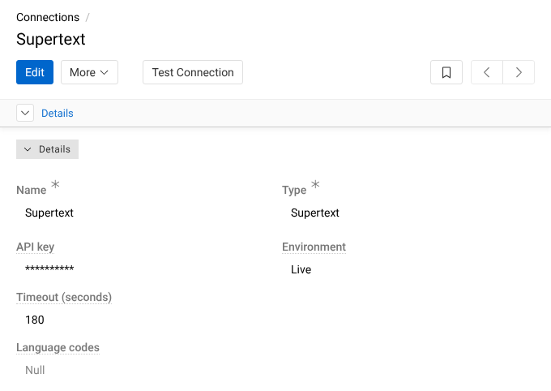
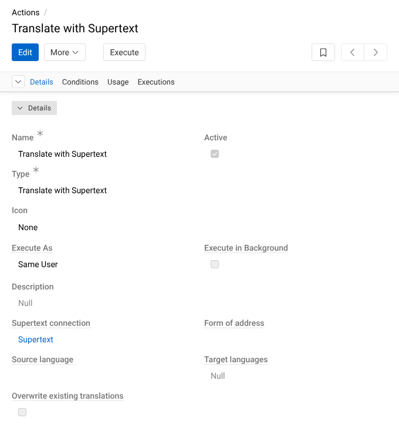
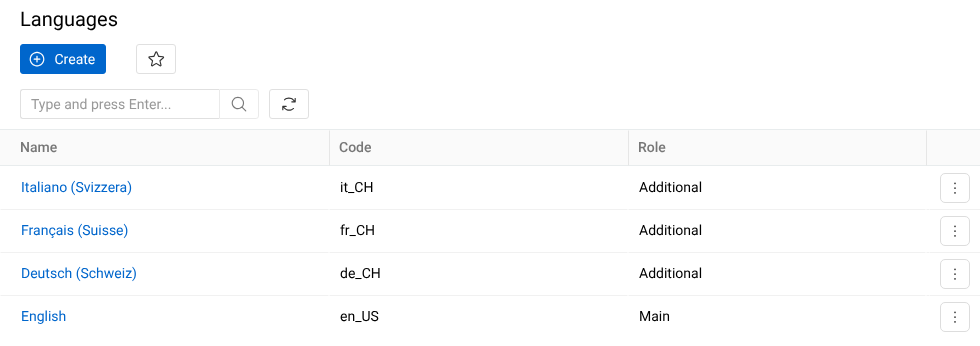

# Installation guide — Supertext Translation for AtroPIM

For administrators. The module adds **Translate with Supertext** to AtroPIM (and any other AtroCore application): a button on products and other records, and a mass action in their lists, that translates the record's multilingual text fields into your other languages with Supertext AI.

## Requirements

- AtroCore 2.4 or later with AtroPIM 1.16 or later (tested with AtroCore 2.4.7 and AtroPIM 1.16.10), on PHP 8.4 with the `curl`, `dom` and `mbstring` extensions (AtroCore needs them anyway).
- At least two languages under **Administration → Languages**, and multilingual fields (see [Languages](#languages)).
- AtroCore's cron job (`php console.php cron` every minute, part of every AtroCore installation) for translations that run in the background.
- A Supertext account with an AI API key. No Supertext account yet? Create one at supertext.com: <https://www.supertext.com/person/en/account/signin>. Generate your API key at supertext.com → Integrations → API: <https://www.supertext.com/en/integrations/api> (requires the Admin role).
- The server must reach `https://api.supertext.com` over HTTPS.

## Install

The module is installed with AtroCore's installer (`atrocore-installer.phar`, the Composer wrapper in your AtroCore directory), like AtroCore's own modules.

1. Add this repository to the `repositories` list of your AtroCore project's `composer.json` (the module is not on a package registry yet):

   ```json
   "repositories": [
     {"type": "vcs", "url": "https://github.com/Supertext/AtroPIM-Supertext-Translation"}
   ]
   ```

   Keep the entries that are already there (AtroCore's own registry).

2. In the AtroCore directory, install it:

   ```bash
   php atrocore-installer.phar require supertext/atropim-supertext-translation:dev-main
   ```

   The installer runs AtroCore's update afterwards: it registers the module, adds the database columns of the action options, clears the cache and copies the front-end files. Once versions are released (see the [releases](https://github.com/Supertext/AtroPIM-Supertext-Translation/releases)), require a version such as `:^0.1` instead of `:dev-main`.

3. Reload AtroPIM in the browser. **Administration → Updates & Modules** lists *Supertext Translation* with its version.

4. Create the Supertext connection ([API key](#api-key)) and the action ([The action](#the-action)).

### Update

```bash
php atrocore-installer.phar update
```

Then reload AtroPIM. Settings, the connection and the actions are kept.

### Uninstall

1. Delete the actions of type *Translate with Supertext* (**Administration → Actions**) and the connections of type *Supertext* (**Administration → Connections**).
2. `php atrocore-installer.phar remove supertext/atropim-supertext-translation`
The columns the module added to the `action` table (`supertext_…`) stay in the database unused.

Translations that were already made stay in your records: they are ordinary field values.

## API key

The key is stored in a **connection** of type *Supertext*, encrypted like every password in AtroCore.

1. Open **Administration → Connections** and click **Create**.
2. Enter a name (e.g. *Supertext*), choose the type **Supertext** and paste the key into **API key**. You can paste it with or without the `Supertext-Auth-Key` prefix Supertext shows it with.
3. Save, then click **Test connection**: it checks the key with Supertext (free of charge).



The field's tooltip has both links: no Supertext account yet? Create one at <https://www.supertext.com/person/en/account/signin>. Generate your API key at <https://www.supertext.com/en/integrations/api> (supertext.com → Integrations → API; requires the Admin role).

Instead of entering the key in AtroPIM you can set it on the server as the environment variable `SUPERTEXT_API_KEY`; it is used when the connection has no key (or when there is no Supertext connection at all). The connection's key takes precedence.

## The action

Translating is an AtroCore **action** of the new type *Translate with Supertext*. Create one per kind of record that should be translatable (usually one for *Product*):

1. **Administration → Actions → Create**.
2. **Name**: what editors see on the button, e.g. *Translate with Supertext*. **Type**: *Translate with Supertext*.
3. **Usage**: *Record*; **Source entity**: *Product* (or *Category*, *Brand*, …); **Display**: *Single* shows a button next to *Edit*, *Dropdown* puts it in the *More* menu. Leave **Mass action** on to offer it in the list's *Actions* menu.
4. **Execute as**: *Same user* (recommended) saves the translation with the editor's permissions and in the editor's name; *System* lets anyone who sees the button translate.
5. The Supertext options (see [Settings](#settings)): connection, source and target languages, overwrite, form of address.
6. Optional: **Execute in background** runs the translation as a job; the editor gets a notification when it is done.



Several actions are fine, e.g. *Translate into French* with only `fr_FR` as target, or one that overwrites existing translations for a chief editor. AtroCore's **Conditions** panel limits the records the action runs on, for example only products in status *Draft*.

## Languages

AtroCore translates between its **languages** (**Administration → Languages**): the main language plus additional ones.



- A field is translated only if it is **multilingual**: under **Administration → Entities → Product → Fields**, open the field and tick *Multilingual*. AtroPIM's name, short description and long description are multilingual by default. For attributes, tick *Multilingual* on the attribute.
- Each language goes to Supertext as its code with a hyphen: `de_CH` becomes `de-CH`. If a language needs another Supertext code (e.g. Swiss spelling for a `de_DE` language), add a line `de_DE = de-CH` to the connection's **Language codes**.
- The source language is the main language unless the action sets another one.

## Which fields are translated

Multilingual text fields (*varchar*, *text*, *markdown* and *wysiwyg*) of the record, attribute values included. Rich text keeps its formatting (bold text, links, lists). Everything else (numbers, lists of options, files, relations, …) stays as it is. Fields that are read-only are skipped. The [user guide](USER_GUIDE.md#what-is-translated) has the details.

## Interface languages

The module's labels, tooltips and options (the action type, the action and connection fields) and its messages (action results, errors, *Test connection*) are available in English, German, French and Italian. They follow each user's AtroCore interface language: the language of the *Locale* in the user's profile, or the system's default locale. Other languages show the English texts. The console commands (`supertext check`, `supertext translate`) answer in English; an execution's log keeps the language of the user who ran it.

## Permissions

| What | Who |
| --- | --- |
| See and run the action | Everyone who may read the entity (**Administration → Roles**: *Read* on the entity; the demo's editor role also has *Read* on *Actions*). |
| Save the translation | With *Execute as: Same user*: whoever may edit the record (*Edit*; for attribute values also *Create attribute value*). With *Execute as: System*: anyone who may run the action. |
| Connections and actions | Administrators. |

Use **Conditions** on the action, or roles, to show the button only to the right people.

## Settings

Connection (**Administration → Connections**, type *Supertext*):

| Setting | Default | |
| --- | --- | --- |
| API key | none | Encrypted. Falls back to the environment variable `SUPERTEXT_API_KEY`. |
| Environment | Live | *Live* (`https://api.supertext.com/v1/`), *Staging*, *Testing* or *Custom URL*. The environment variable `SUPERTEXT_API_URL` overrides it (for tests against a stand-in API). |
| API URL | none | Only for *Custom URL*. |
| Timeout (seconds) | 180 | How long to wait for one language (30 to 1800). |
| Language codes | none | One line per language whose Supertext code differs: `de_DE = de-CH`. |

Action (**Administration → Actions**, type *Translate with Supertext*):

| Setting | Default | |
| --- | --- | --- |
| Supertext connection | the first connection of type Supertext | Which key and settings to use. |
| Source language | the main language | The language to translate from. |
| Target languages | every other language | The languages to translate into. |
| Overwrite existing translations | off | Off: fields that already have text in a target language are kept. On: they are replaced. |
| Form of address | Default | *Formal* or *Informal*, for languages that have both (German *Sie*/*du*, French *vous*/*tu*, …). |

AtroCore's own action settings apply as usual: *Execute as*, *Execute in background*, *Mass action*, *Display*, *Conditions*.

The installed version is shown under **Administration → Updates & Modules** and by `php console.php "supertext check"`, which links X.Y.Z versions to their GitHub release.

## Console commands

```bash
php console.php "supertext check"                                  # version, languages, connection; is the key accepted?
php console.php "supertext translate Product <id>"                 # into all other languages
php console.php "supertext translate Product <id> de_CH,fr_CH --overwrite --politeness=more"
php console.php "supertext translate Category <id> all --source=de_CH"
```

The commands use the first Supertext connection (or `SUPERTEXT_API_KEY`) and run as AtroCore's system user. Without `--overwrite`, fields that already have text are kept.

## Troubleshooting

| Problem | What to do |
| --- | --- |
| The type *Supertext* is missing under Connections, or *Translate with Supertext* under Actions | The module isn't registered: check **Administration → Updates & Modules**, run `php atrocore-installer.phar update` and reload the browser. |
| "No Supertext API key is configured" | Enter the key in the Supertext connection, or set `SUPERTEXT_API_KEY`. No Supertext account yet? Create one at <https://www.supertext.com/person/en/account/signin>. Generate your API key at <https://www.supertext.com/en/integrations/api> (requires the Admin role). |
| "Authentication failed. Please check the Supertext API key." | The key is wrong or revoked. Generate a new one at supertext.com → Integrations → API (<https://www.supertext.com/en/integrations/api>, Admin role) and paste it again; **Test connection** confirms it. |
| "… has no multilingual text fields" | Make the fields multilingual and add a second language (see [Languages](#languages)). |
| "Too many requests to Supertext" | The API limits requests per second. The module retries automatically; if it still fails, translate fewer records at once or use *Execute in background*. |
| "Timed out waiting for the Supertext translation" | Raise the connection's **Timeout**, or use *Execute in background* for long texts. |
| "The translation is longer than the field allows" | A plain-text field has a maximum length; the other fields were translated. Shorten the source or raise the field's maximum length. |
| "AtroPIM did not accept the translation" | AtroCore's validation rejected the value (the reason follows). Fix the field's rules or the source text. |
| The button is missing on a product | The action must be active, its *Source entity* the record's entity and *Usage* *Record*; check the user's role (*Read* on the entity and on *Actions*). |
| Background translations never finish | AtroCore's cron job isn't running (`* * * * * php /path/to/atrocore/console.php cron`). |
| Where is the detail of a run? | Open the action, panel **Executions**: every run with its status and message per language. |
