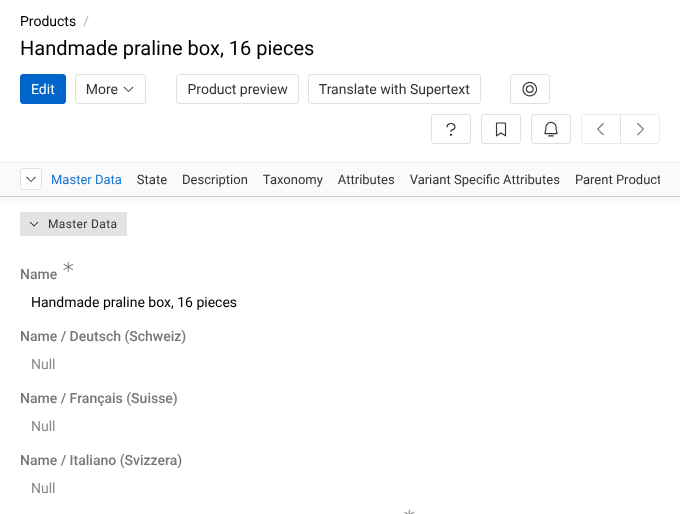
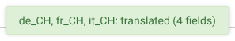
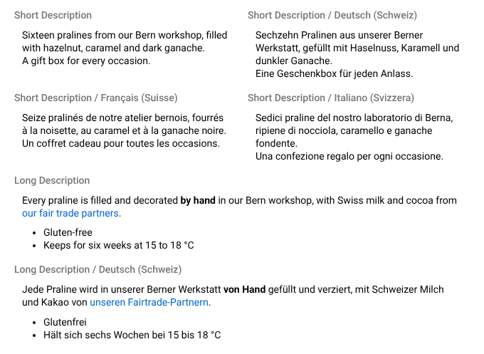
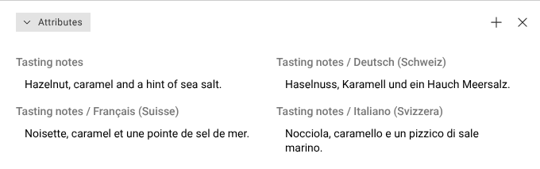
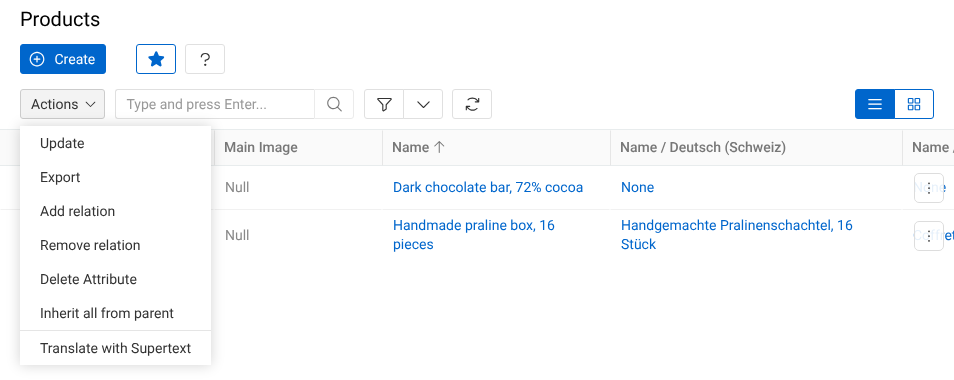
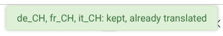

# User guide — Supertext Translation for AtroPIM

For editors. **Translate with Supertext** translates a product's texts (or another record's) from one language into your other languages with Supertext AI, and saves them in the record's language fields. Your administrator decides which languages and records it covers (see the [installation guide](INSTALLATION.md#the-action)).

The Supertext fields and messages follow your AtroCore interface language (English, German, French or Italian, from the locale in your profile). The messages below are the English texts.

## Translate a product

1. Open the product. The texts in the other languages are still empty (*Null*):

   

2. Click **Translate with Supertext** (next to *Edit*, or in the *More* menu, depending on your setup).
3. After a few seconds AtroPIM shows what was translated, per language:

   

4. The page reloads with the translations:

   

Long texts keep their formatting, and attribute values are translated too:

## Translate several products

In the product list, select the products, open **Actions** and choose **Translate with Supertext**. Each product is translated on its own; the message says how many were translated. Large selections run in the background, and AtroPIM notifies you when they are done.

## Review the translation

The translation is saved right away, like a change you make yourself: it appears in the product's history (*Activities*), and AtroPIM's rules for the fields apply. Read it in each language, correct it with **Edit** where needed, and change the product's status as you usually do. Supertext AI is good, but it doesn't know your product range: check names, measurements and terms that must stay the same.

## Translate again

Translating again **keeps** every field that already has text in a language, so your corrections are never lost:

To translate a changed text again, empty that field in the target language (**Edit**, delete the text, save) and click **Translate with Supertext**. If your administrator has set up an action that overwrites existing translations, it replaces all target texts at once; use it with care.

## What is translated

| Translated | Not translated |
| --- | --- |
| Multilingual text fields: single-line text, multi-line text, Markdown and rich text (HTML) | Fields that aren't multilingual |
| Multilingual attribute values of these types | Numbers, dates, lists of options, booleans, files, relations |
| Rich text with its formatting: bold and italic text, links, lists, headings | Read-only fields |
| | Fields that are empty in the source language |

- Each text is translated as a whole, so sentences stay intact.
- A target language that already has text in a field is kept unless the action overwrites.
- Single-line fields have a maximum length; a translation that is longer is not saved (the message names the field) and the other fields are.

## Messages

| Message | Meaning |
| --- | --- |
| `de_CH, fr_CH: translated (4 fields)` | Done: four fields were translated into German and French. |
| `it_CH: kept, already translated` | Every field already had Italian text: nothing changed. |
| `nothing to translate` | The source language has no text in the translatable fields. |
| `Supertext translated 3 of 4 records.` | Several products: one failed; the action's **Executions** panel (administrators) shows why. |
| `The translation is longer than the field allows: Name` | The Name translation was too long and not saved; the other fields were. |
| `No Supertext API key is configured …` / `Authentication failed …` | The Supertext connection isn't set up yet. Ask your administrator. |
| `Too many requests to Supertext` / `Timed out …` | Supertext was busy or the text was long. Try again in a moment. |
| `… has no multilingual text fields` | This kind of record has nothing to translate. Ask your administrator. |
| `Translate with Supertext is finished. To view the result, click here` | AtroPIM's notification when the action has run; the link opens the run's details. |
